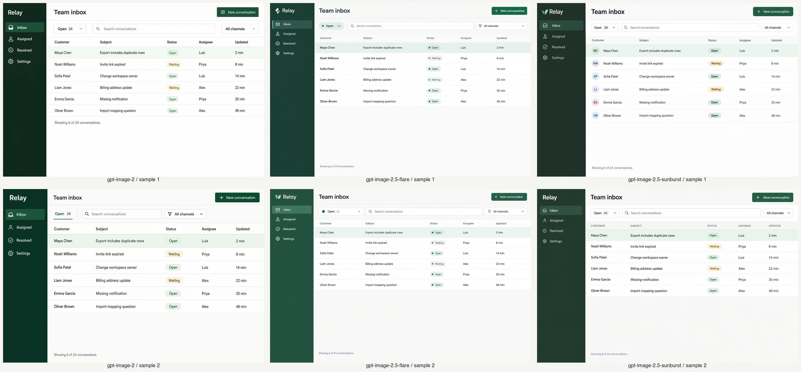
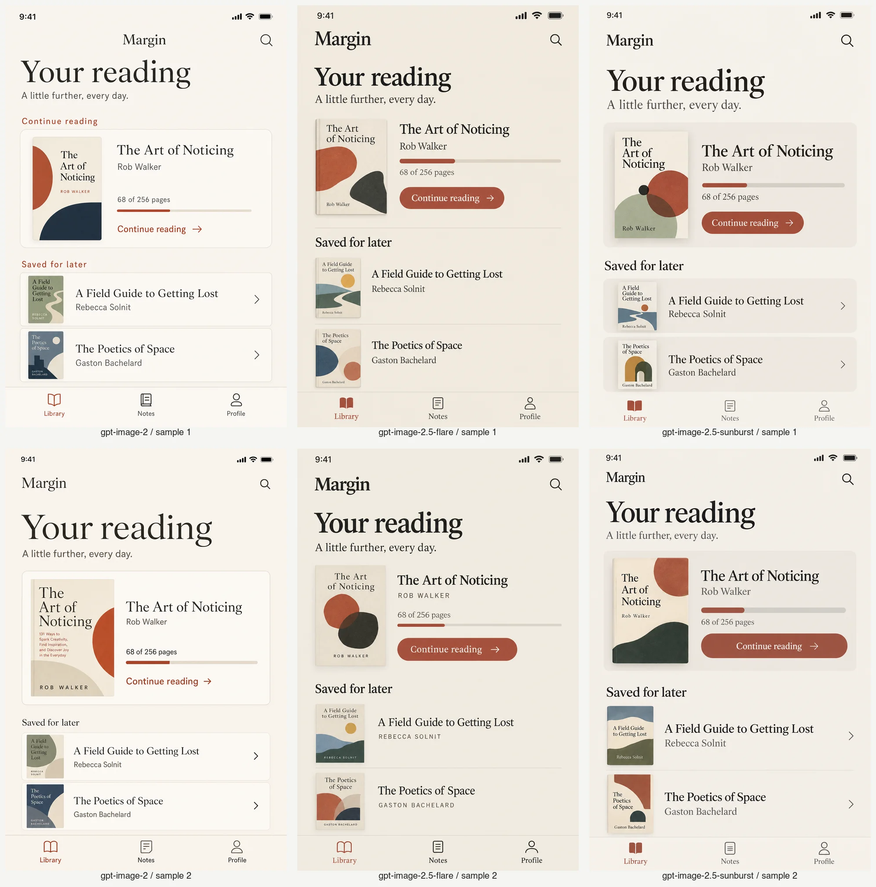
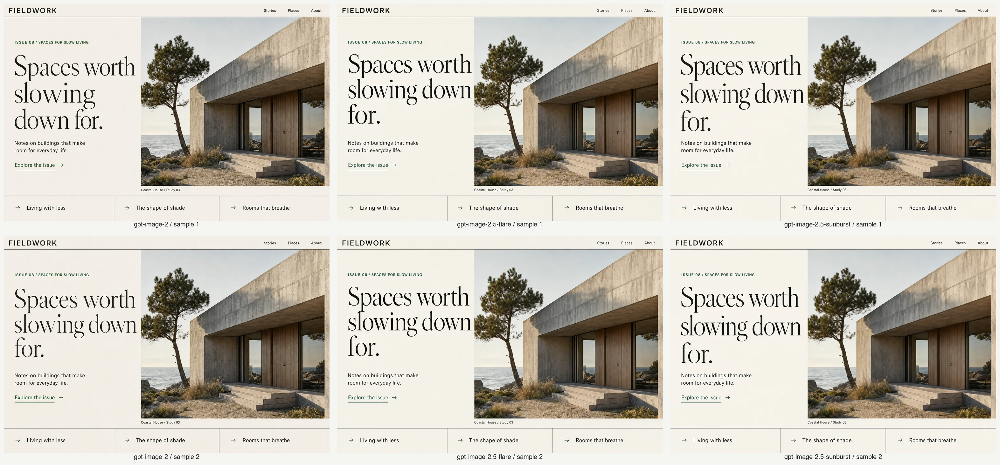

# GPT Image 2.5 comp evaluation

Run date: September 8, 2026. Prepared and visually reviewed with AI assistance.

## Decision

Use **Flare as the API fallback default**, with `--model` available for
Sunburst or the Image 2 baseline. In this small sample, Flare improves
typographic finish and some brief adherence while preserving the core comp
content. The stronger result is efficiency: **79% lower median latency and
73% lower estimated mean cost** than Image 2 at the same `high` quality label.
Sunburst does not show a consistent comp-quality advantage over Flare here.

This is **not an across-the-board fidelity win**: both Image 2.5 models redraw
more of the untouched photograph in the shared-reference edit than Image 2.
That tradeoff matters when preserving exact pixels is the priority; the model
override keeps the baseline available without modifying the engine.

## Timing and usage

All 24 requests succeeded. [Raw results](results.json) include every prompt,
request ID, image hash, usage record, elapsed time, and preservation metric.

| Model | Samples | Median | Range | Mean estimated cost/image |
| --- | ---: | ---: | ---: | ---: |
| Image 2 | 8 | 87.91 s | 80.79–94.19 s | $0.1691 |
| Image 2.5 Flare | 8 | 18.10 s | 14.53–21.43 s | $0.0456 |
| Image 2.5 Sunburst | 8 | 25.34 s | 22.21–29.58 s | $0.0456 |

Every 2.5 output used 1,372 image output tokens, versus 5,488 for Image 2.
The equal quality label therefore does **not** mean equal token consumption.
Estimated total for the 24-call comparison: **$2.08**, excluding the two
separate CLI smoke calls. Costs use reported text/image input tokens and
image output tokens at $5/$8/$30 per million respectively; no cached-input
discount is assumed. These are usage-based estimates, not an invoice.

## Method

Compare `gpt-image-2`, `gpt-image-2.5-flare`, and
`gpt-image-2.5-sunburst` on four fixed comp briefs, with two samples per cell:
24 Images API requests. All use `quality: high`, `n: 1`, and identical prompts
and sizes: 1536×1024 for editorial, dashboard and edit; 1024×1536 for mobile.
Every edit receives the same Image 2 editorial reference (sample 1).
Models run concurrently within each sample, at most three requests at a time.

The prompts are synthetic product briefs shaped around Impeccable's comp
workflows. This isolates the image model; it does not measure a whole design
agent session or the quality of the eventual HTML/CSS implementation. Review
was not blinded. Two samples are exploratory evidence, not statistical proof.
The `medium` CLI default and 2.5's new `xhigh`/`max` quality levels are outside
this comparison; the PR preserves the existing default quality.

The [fixtures and run instructions](../../../tests/fixtures/image-generation/README.md)
make the experiment repeatable. The runner records exact prompts, hashes,
request IDs, usage and timing, and builds a full-resolution local gallery.
The sheets below contain **every sample**, downscaled and compressed for
review; original PNGs remain in the run directory. Columns are Image 2,
Flare, Sunburst; rows are samples 1 and 2.

## Visual observations

### Editorial decision comp

All six preserve the main content and broad editorial/photo structure.
Flare favors heavier display type, while Sunburst adds more developed teaser
imagery. The 2.5 samples look more art-directed to this reviewer, but Image 2
already produces an attractive, readable comp. This case supports a modest
finish improvement rather than a dramatic gain in correctness. The requested
40/60 split remains approximate across models.


### Dense surface comp

All six render the six requested customers, subjects, statuses, assignees,
and update times correctly. Flare is more compact than Image 2 in these
samples and its table typography is more natural; Sunburst is also clear but
does not establish a consistent advantage over Flare. All avoid the unwanted
hero, chart, and metric cards. None should be treated as pixel-exact output:
the requested 210px sidebar and 72px header are visibly enlarged across all
three models. Text was cross-checked with local macOS Vision OCR and visual
inspection; OCR alone does not establish correct table relationships.



### Portrait north-star comp

All six keep the complete portrait composition, three books, correct main
titles/authors, progress label, and full bottom navigation in frame. Flare's
samples use a lighter container treatment and coherent book-cover artwork;
Sunburst is similarly polished with more prominent feature grouping. Image 2
sample 2 adds an unrequested multi-line book subtitle that the four 2.5
samples do not. This is a useful instance of tighter brief adherence, though
the main content was already correct in Image 2. Progress-bar fill remains
approximate rather than an exact visualization of 68/256 pages.



### Reference-based refinement

All six replace the headline exactly, switch the accent to green, preserve
the other copy, and retain the original page structure without headline
overlap. All redraw some photographic detail. Image 2 retains more of the
reference's fine texture; the 2.5 samples visibly change wood/concrete
texture, foliage and lighting. Sunburst is a little closer than Flare on
average, but neither beats Image 2 in this preservation test.

The untouched photo region is the original image's pixel box
`x=647, y=62, width=889, height=797`. Compare the same box in every output,
without resizing or alignment, using normalized RGB RMSE (0 means identical;
lower is closer). This measures **pixel preservation, not aesthetic quality**.
Small shifts and texture changes can raise it even when the scene remains
recognizable.

| Model | Sample 1 | Sample 2 | Mean photo RMSE |
| --- | ---: | ---: | ---: |
| Image 2 | 0.04415 | 0.04421 | 0.04418 |
| Image 2.5 Flare | 0.07331 | 0.06737 | 0.07034 |
| Image 2.5 Sunburst | 0.06585 | 0.06629 | 0.06607 |

Reproduce for any `reference.png` / `edit.png` pair with ImageMagick:

```sh
magick reference.png -crop 889x797+647+62 +repage \
  \( edit.png -crop 889x797+647+62 +repage \) \
  -channel RGB -metric RMSE -compare -format '%[distortion]' info:
```



## Engineering validation

- Added failing Rust regressions before changing the default; verified both
  JSON generation and multipart reference-edit model selection, overrides,
  sidecars and output messages. All 39 affected-crate tests pass.
- `cargo test --workspace`: 441 tests pass.
- `cargo build --release -p impeccable`: pass.
- `IMPECCABLE_BIN="$PWD/target/release/impeccable" bun run test`: pass.
  Includes the oracle, framework fixtures and real plugin-loader E2E; two
  opt-in provider-backed manual-edit replays are skipped by the suite.
- `IMPECCABLE_BIN="$PWD/target/release/impeccable" bun run test:new-work-e2e`:
  all 20 offline comp/decision-page tests pass.
- `bun run build`: pass, with generated provider output intentionally omitted.
- Two additional billed calls through the rebuilt CLI succeed: default Flare
  generation and explicit Sunburst reference edit, including embedded prompt
  and model sidecar. These are smoke tests, excluded from comparison timing.

## API sources

The [launch announcement](https://openai.com/index/introducing-chatgpt-images-2-5/)
positions Flare as the general default and Sunburst for precision workflows.
The [image-generation guide](https://developers.openai.com/api/docs/guides/image-generation)
documents the model IDs, quality levels, compatible endpoints, and token
rates. Both 2.5 models share Image 2's token rates; actual image cost depends
on usage, not just the selected quality label.
