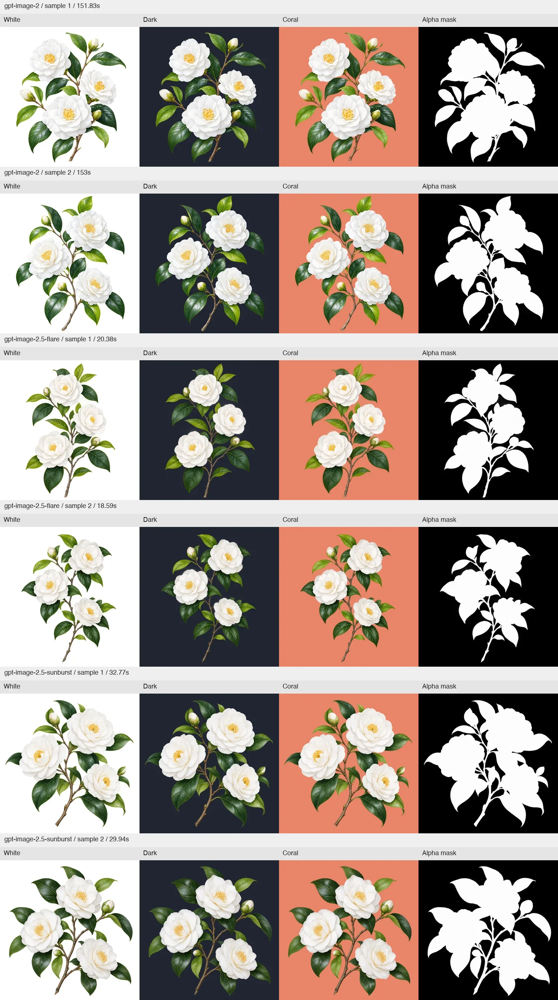
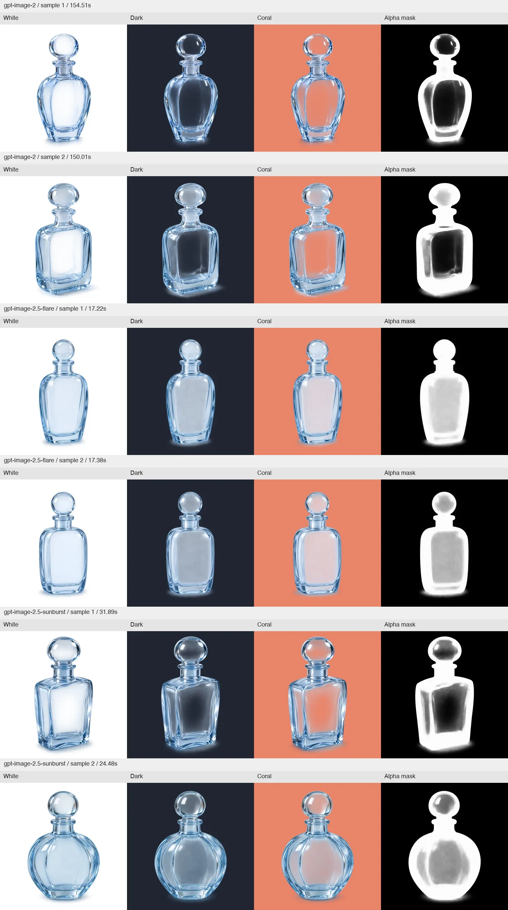
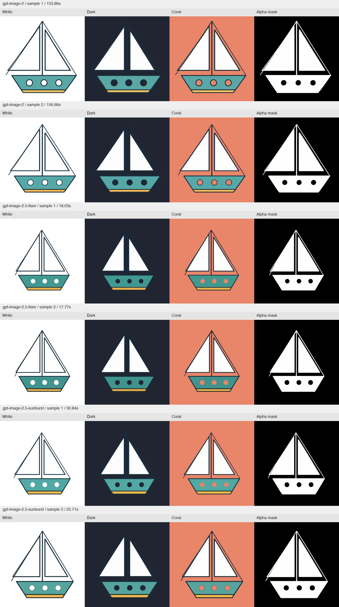
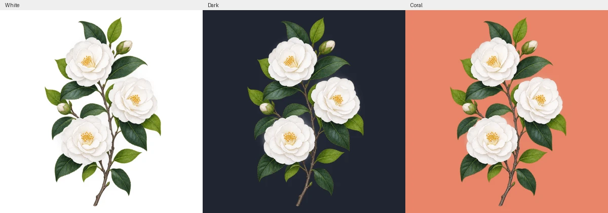
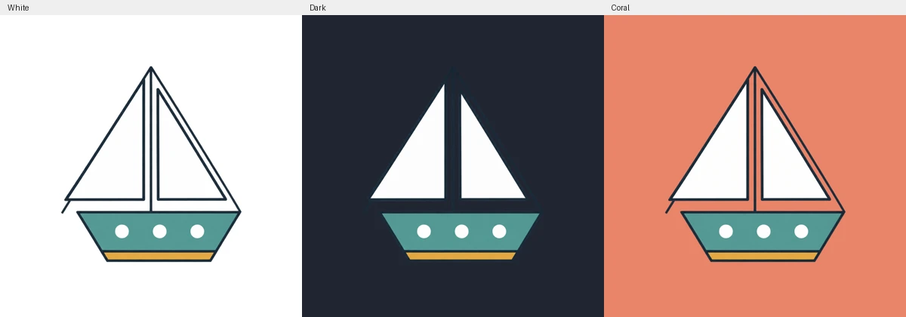
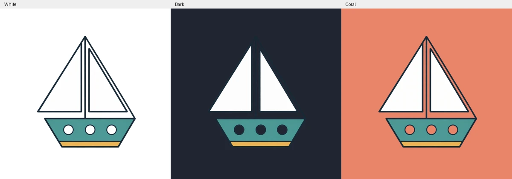

# Native transparency evaluation

September 8, 2026. Prepared and visually reviewed with AI assistance.

## Finding

Native PNG alpha works and is useful for the asset producer's isolated
illustrations and cutouts. It removes the need to generate a chroma background
and key it away for these cases. This is **not exclusive to Image 2.5**:
Image 2 also returned real transparency in this run.

The [Images API guide](https://developers.openai.com/api/docs/guides/image-generation)
documents `background: "transparent"` with PNG or WebP for both 2.5 models.
The [Image 2 cookbook](https://developers.openai.com/cookbook/examples/multimodal/image-gen-models-prompting-guide#54-product-mockups-transparent-background--label-integrity)
also documents preview transparency for Image 2. The tests here use PNG only;
they do not validate WebP or harness-native image tools.

Use this capability selectively for isolated assets. Glass remains variable,
and native alpha does not guarantee exact preservation of an approved comp.

## Method and evidence

Three cases × three models × two samples, all `high`, 1024×1024, with explicit
`background: transparent` and `output_format: png`. Botanical and glass cases
use JSON generation; plate extraction uses multipart `image[]` editing with
a shared 640×640 reference. There are at most three concurrent requests.
This is an exploratory, unblinded review, not a statistical quality benchmark.

[Fixtures and commands](../../../../tests/fixtures/image-generation/README.md)
and the [alpha review helper](../../../../tests/image-transparency-review.py)
make the test repeatable. The helper measures decoded alpha rather than
inferring transparency from a white or checkerboard preview. It composites
over white, dark, and coral backgrounds, and displays the alpha mask.
Some image viewers expose RGB values hidden under alpha zero; those RGB
values are not the visible composited image.

The final [request records](results.json) contain exact prompts, request IDs,
image hashes, usage, and timing. [Alpha measurements](alpha-results.json)
contain full alpha histograms, border readings, and geometry probes.

Five initial plate attempts used an invalid blank or incomplete fixture from
an SVG renderer and were excluded before making preservation claims. They
are retained in [excluded attempt records](excluded-fixture-attempts.json).
The final fixture is generated deterministically with Pillow, with assertions
for sails, rigging, and holes, and was visually inspected before the corrected
calls. Only requests matching the validated input hash are in the final
comparison; successful botanical/glass requests were reused without billing
them again. This is an experiment-setup correction, not removal of poor model
outputs. The input SHA-256 is
`7669c7005bf413ade1bbc077b1919a7da300fb613afe8f98728825320ed4957b`.

All **18 valid requests succeeded** and produced RGBA PNGs. Every image has
alpha spanning 0–254, with 55.6–76.7% of pixels exactly clear. Border alpha
never exceeds 2/255. There are no exactly opaque 255 pixels: light foregrounds
are visually solid but not mathematically fully opaque. Treating every
1–254 pixel as meaningful translucency would therefore be misleading; the
glass test separately measures a central body region and uses alpha <250.

| Model | Samples | Median request time | Mean estimated cost/image |
| --- | ---: | ---: | ---: |
| Image 2 | 6 | 153.43 s | $0.2143 |
| Flare | 6 | 17.90 s | $0.0563 |
| Sunburst | 6 | 30.39 s | $0.0563 |

Estimated cost: **$1.96 for the valid comparison**, plus **$0.63 for the five
excluded fixture attempts** ($2.59 comparison total, excluding the subsequent
CLI smoke calls below). These use reported text/image input
and image output tokens at $5/$8/$30 per million respectively, with no cache
discount assumed, as in the [comp report](../README.md). They are estimates,
not invoice totals. The same quality label consumes different token counts:
each 2.5 output uses 1,756 image tokens, versus 7,024 for Image 2.

## Botanical cutouts

All six samples have real clear backgrounds and gaps, preserve visually solid
white petals, and retain fine stems and leaf tips. The composites show no
obvious rectangular matte or broad chroma fringe. All keep the complete
branch inside the frame. This is the strongest practical asset-producer case.
White paint remains present against dark and colored backgrounds; it has not
been confused with the transparent ground.

[Original Flare cutout PNG](botanical-gpt-image-2.5-flare-1.png).

## Glass

All six have native partial alpha inside the bottle body, beyond ordinary
edge antialiasing. Highlights and a soft contact shadow remain visible.
However, the two Flare samples look milky on dark/coral backgrounds. Sunburst
sample 1 is much clearer; sample 2 is hazier. A partial-alpha channel alone
does not establish convincing clear glass, and a 2D cutout cannot refract an
arbitrary future background as a 3D glass object would.
Both Image 2 samples are clearer than the Flare samples in this test.

The fixed body probe is `x=461..562, y=512..665` in the 1024px image. Visual
inspection confirms it falls inside each bottle body. Lower alpha transmits
more of the future background; it is not a universal quality score.

| Model | Sample 1 median alpha | Sample 2 median alpha |
| --- | ---: | ---: |
| Image 2 | 14/255 | 12/255 |
| Flare | 205/255 | 181/255 |
| Sunburst | 21/255 | 152/255 |

Every pixel in each body probe has alpha between 1 and 249. This verifies
actual broad translucency, while the composites reveal its visual quality.

[Original Sunburst sample 1 PNG](glass-gpt-image-2.5-sunburst-1.png).

## Reference-based plates

The input has two white sails, thin dark rigging, a teal hull, a gold keel,
three circular holes, and a cream page background. The task is to remove
the page ground and holes to alpha while preserving paint and geometry.

The 2.5 outputs preserve the two light sails and three transparent holes,
with clear rigging gaps and no cream matte. They also change the artwork's
scale and placement. Native alpha solves background removal; these outputs
still need geometry correction or regeneration before they can stand in for
the approved plate exactly. Fixed-coordinate hole probes consequently hit
other parts of the boat in some outputs; that is placement drift, not a lack
of transparent holes.

Image 2 also retains white sails and transparent holes, but enlarges the
artwork and adds outlines around the holes. Silhouette IoU against the known
reference (resized to 1024px, alpha ≥128, **no positional alignment**) quantifies
placement/scale drift, not artistic quality. A perfect match is 1.0:

| Model | Sample 1 alpha IoU | Sample 2 alpha IoU |
| --- | ---: | ---: |
| Image 2 | 0.36641 | 0.40278 |
| Flare | 0.60957 | 0.59162 |
| Sunburst | 0.53506 | 0.43086 |

Flare is closer in this fixture, but none is a faithful geometric replacement.

[Original Flare plate PNG](plate-gpt-image-2.5-flare-1.png).

## Impeccable integration

`generate-image --background transparent` now requests native transparent PNG
on both the generation and reference-edit endpoints, preserves returned alpha,
and records `background` and `outputFormat` in the prompt sidecar. It rejects
invalid background values and non-PNG output paths for every explicit background
mode before billing.
`opaque` and `auto` are also accepted; omitting the option preserves the prior
API defaults. Fake mode can emit a real RGBA cutout for offline testing.

`comp-spec --plate-prompt <id> --background transparent` authors a cutout
prompt that preserves white paint, fine edges, holes, and reference margins.
The asset-producer and build guidance now use the supported crop → prompt-file
→ reference-edit commands, selecting native alpha for isolated cutouts and
opaque output for photos/full-frame imagery. Earlier instructions advertised
a `generate-image --plate` shortcut that the runtime did not implement; those
paths now use explicit `--ref`, `--prompt-file`, `--out`, and `--size` arguments.
Native image tools keep precedence and receive the same cutout prompt.

The downstream foundation already decodes RGBA PNGs and alpha-composites
plates over the region's sampled ground before scoring. A real generated
Flare botanical PNG passed `embed-prompt` with **every decoded RGBA byte
unchanged**, and `comp-diff` decoded it with an exact self-match. These checks
exercise local file handling, not a full asset-producing agent session.

All six valid boat PNGs also passed the existing `build-phase` plates gate
in an isolated fixture workspace: 640px opaque reference, one raster plate
region, 1024px generated PNG, cream sampled ground, no forced advance.
[Gate records](plate-gate-smoke.json) preserve the results and scores. Test
setup initialized the state directly at the plates phase; it did not exercise
earlier agent phases. The passes establish format/alpha compatibility with
the current gate, **not exact reference fidelity**—the drift above remains
visible despite those passes.

Validation also includes the full `bun run test` suite against the rebuilt
engine (pass; two opt-in provider replays skipped), runner syntax and both
suite dry runs, and deterministic reference-render assertions.

## Live CLI integration checks

Three additional billed requests exercise the rebuilt engine, rather than
calling the API from the comparison runner: one botanical generation, one
boat reference edit, and one refinement of that edit. The edit uses the real
`comp-spec --crop` and `comp-spec --plate-prompt --background transparent`
commands. [CLI records](cli-integration-results.json) include arguments,
prompts, sidecars, timings, image hashes, and alpha probes.

Both endpoints return native RGBA PNGs and record the selected background,
PNG format, model, references, and embedded prompt correctly. The botanical
cutout has 65.25% fully clear pixels and clean light foregrounds.

The first boat output has a clear exterior but paints its three openings
near-opaque white (alpha 254). The prescribed visual check catches this;
alpha-channel presence alone would not. One prompt refinement explicitly
identifies the three openings as alpha-zero holes. All three tested centers
then have alpha 0, while both white sail probes remain at 254. Geometry still
needs review, as in the earlier comparison. These results validate the
inspection/refinement workflow, not a guarantee that every first attempt
will be usable.

The integration adds failing-first regressions for JSON generation and
multipart editing, explicit/omitted background handling, unchanged PNG image
chunks after embedding, invalid requests, fake-mode RGBA output, cutout
prompt authoring, and executable plate guidance. All **448 Rust tests** and
all **20 offline new-work E2E tests** pass. The full Bun/Node suite passes
against the rebuilt release binary. The one additional oracle update is
the reviewed `comp-spec` help line advertising the background option.

The opt-in provider-backed skill-behavior suite was also run: **60/66 pass**
across Sonnet 5, GPT 5.6 Terra, and Gemini 3.7 Flash. Sonnet's planning-only
context-loading failure passed a focused retry. Terra's three advice/comparison
wording assertions failed again and also failed against the committed
pre-integration skill (`245fb464`). Gemini's missing-surface wording failure
also reproduced on that baseline; its comparison wording check passed on the
baseline but failed in the integration run. That last stochastic wording
failure remains unresolved. These checks concern onboarding advice and
command explanations, not alpha generation; the suite is **not fully green**.
The baseline runs use the prior skill files with the same rebuilt engine,
which those read-only advice scenarios do not invoke for image generation.
