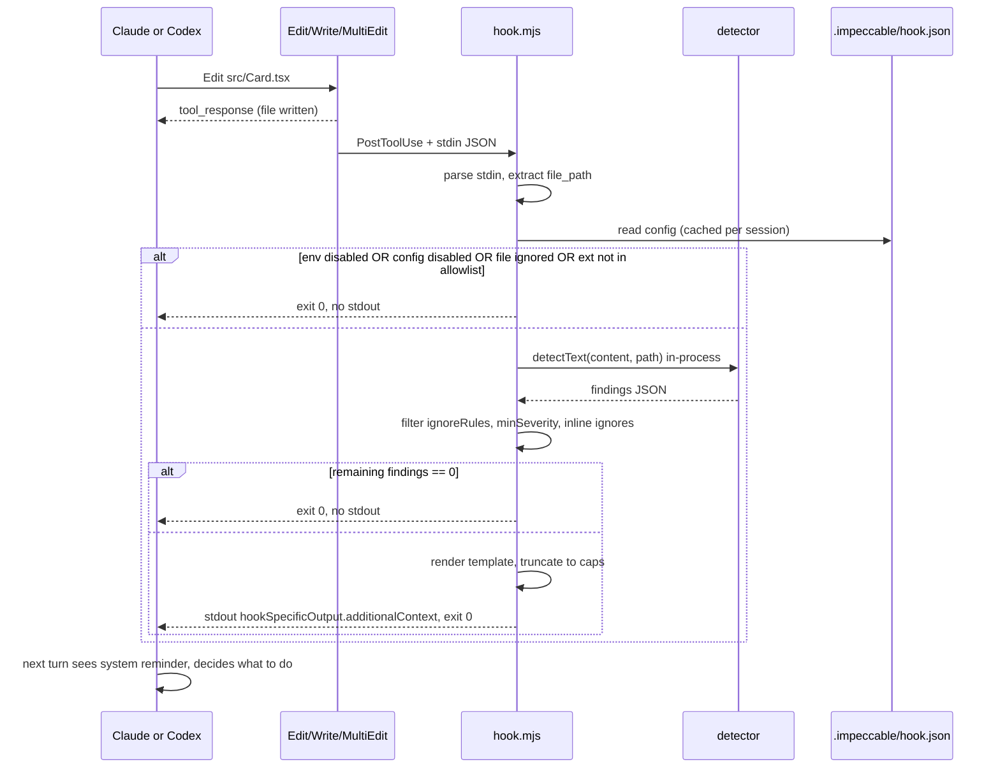

# PRD: Design detector hook (Claude Code + Codex)

| Field | Value |
|---|---|
| Status | Draft, awaiting implementation |
| Owner | TBD |
| Created | 2026-05-28 |
| Target version | Skill v3.2.0 (next minor) |
| Scope | Net-new feature, additive only |

## 1. Summary

Ship a `PostToolUse` hook inside the Impeccable plugin so the existing design detector runs automatically after every relevant file write. Findings (if any) are fed back into the agent's context as a short system reminder so the model can course-correct on its next turn. The hook is silent on clean files and never blocks an edit.

Think of it as the spell-checker squiggle for AI-generated UI. The detector already catches 16 visual "AI tells" (side-tab borders, gradient text, icon-tile stacks, purple palette defaults, bounce easing, etc.). Today those only get caught when the user notices in review or runs `/impeccable audit` after the fact. The hook closes the loop at the moment the slop is written.

## 2. Goals and non-goals

### Goals

- Catch slop tells at the moment the agent writes them, not after the user notices in review.
- Keep the agent flow uninterrupted. Hook is purely advisory; the model decides whether to fix now or note for later.
- Ship to both Claude Code and Codex with a single shared hook script.
- Zero-friction install: enabling the plugin should be the only step on Claude Code.
- Document the one trust step Codex requires and the CI escape hatch.
- Stay under any context budget that might compete with the user's actual work.

### Non-goals

- Replacing `/impeccable audit` or `/impeccable critique`. Those remain the canonical full-coverage flows.
- Catching layout or computed-style rules. Those need a rendered page, not source files.
- Blocking edits. Even severe findings stay advisory in v1.
- Linting non-UI files. No Python, no Go, no markdown, no JSON.
- Supporting hooks on harnesses that do not have a hook system today (Cursor, Gemini, OpenCode, Kiro, etc.).
- Telemetry. No counts shipped back, no analytics.

## 3. UX

### Default state

The hook is **on by default after install**, in **advisory mode only**. This was confirmed during planning: surprise is acceptable here because the hook is silent on clean files. Users see the hook only when there are real findings to act on.

### Trigger surface

- Event: `PostToolUse`.
- Tool matcher: `Edit | Write | MultiEdit` (Claude Code uses the literal `|`-separated form; Codex parses the same string as a regex).
- File filter: `.tsx`, `.jsx`, `.html`, `.vue`, `.svelte`, `.astro`, `.css`, `.scss`, `.less`, `.ts`, `.js`.
  - Claude Code: native `if: "Edit(*.{tsx,jsx,html,vue,svelte,astro,css,scss,ts,js})"` glob on the handler. The handler never spawns for non-matching files.
  - Codex: no `if:` analog. The hook script inspects the resolved file path and short-circuits before invoking the detector. Slightly more wasted process startups but fundamentally the same outcome.

### Silent pass

When the detector returns zero findings (the common case on most file writes), the hook emits **nothing on stdout** and **nothing as `systemMessage`**. The agent's next turn looks identical to a world with no hook. This is the most important UX guarantee in the whole feature.

### Findings present

When the detector returns one or more findings, the hook emits this single JSON object on stdout:

```json
{
  "hookSpecificOutput": {
    "hookEventName": "PostToolUse",
    "additionalContext": "<rendered template, see below>"
  }
}
```

The rendered template:

```
Impeccable design detector flagged N issue(s) in src/components/Card.tsx:
- L12 [side-tab] Side-tab accent border. Thick colored border on one side of a card, the most recognizable tell of AI-generated UIs. Use a subtler accent or remove it.
- L24 [gradient-text] Gradient text on body copy. Hurts readability and adds visual noise. Reserve gradients for short headlines or remove.
- L47 [icon-tile-stack] Icon tile above heading. The "feature card" pattern that screams AI. Try a horizontal layout or remove the tile.

Consider revising before continuing. To suppress a single rule for this file, add `<!-- impeccable: ignore <rule-id> -->` near the line. To suppress project-wide, edit .impeccable/hook.json. Run /impeccable audit for a full review.
```

Rules for the rendered template:
- Cap at **8 findings** per file. Truncate with `... and N more. Run /impeccable audit for the full report.`
- Hard cap at **8000 characters** total (leaves headroom under Claude Code's 10,000-char `additionalContext` limit and avoids the auto-spill-to-file behavior).
- Each finding renders as one line in the form `- L<line> [<rule-id>] <name>. <description>`.
- Drop the leading `-` indent if line is unknown (`line: 0`).
- Description is rendered verbatim from the registry. We trust the existing wording.

### Tone

Informative, not directive. Words like "consider", "may want to", "if relevant". The model is not being told to drop everything and fix; it is being told what was detected so it can choose. This matches the user's framing during planning: "tell Claude there's design slop and let it course-correct".

### Surface to the user

Nothing in v1. The system reminder goes into the model's context only. No terminal output, no `systemMessage`, no `terminalSequence`. The user sees the consequence (the model addressing or acknowledging the finding on the next turn), not the mechanism.

Rationale: hooks fire constantly; piping anything to the user's terminal becomes spam fast. We rely on the model to surface what matters in its response.

### First-run education

A separate `SessionStart` hook prints one line of `additionalContext` once per session:

```
Impeccable design hook is active. It runs the design detector on .tsx/.jsx/.html/.css/etc. after every Write or Edit and reminds you (via system context) if it finds known design anti-patterns. Disable per project with /impeccable hooks off or globally with IMPECCABLE_HOOK_DISABLED=1.
```

This goes into the model's context, not the user's terminal, so the first time the user asks "why did Claude just mention design issues?" the model can answer accurately. We deliberately do not push a notification at the user.

### Kill switches (precedence high to low)

1. **Env var** `IMPECCABLE_HOOK_DISABLED=1`. For CI, one-off shells, headless runs.
2. **Project config** `.impeccable/hook.json` with `{ "enabled": false }`. Committed to the repo, applies to everyone working in it.
3. **Slash command** `/impeccable hooks off`. Toggles the project config above. Provides the friendly path.

`/impeccable hooks on` reverses it. `/impeccable hooks status` prints current state.

### Suppression schema (`.impeccable/hook.json`)

```jsonc
{
  // Default true. Single switch for the whole hook.
  "enabled": true,

  // Skip findings for these rule ids entirely.
  "ignoreRules": ["repeated-section-kickers"],

  // Skip files matching any of these globs.
  "ignoreFiles": ["src/legacy/**", "**/*.generated.tsx"],

  // Minimum severity to surface. "warning" (default) shows all; "advisory" hides advisory-only rules.
  "minSeverity": "warning",

  // Optional per-rule overrides for the line cap and char cap, mostly for debugging.
  "limits": { "maxFindings": 8, "maxChars": 8000 }
}
```

Also honor inline `<!-- impeccable: ignore <rule-id> -->` in the file itself, scoped to the file. This mirrors the established `.impeccable/critique/ignore.md` pattern in [`skill/reference/critique.md`](../skill/reference/critique.md) but is structured rather than free-form, because the hook needs to evaluate it on every tool call without an LLM pass.

## 4. Hook flow



`PostToolUse` for `MultiEdit` fires once per file affected on Claude Code. On Codex, `apply_patch` (which `Edit|Write` aliases to) fires once per patch operation. We do not need special-case batching in v1; on Claude Code the parallel-batch optimization (`PostToolBatch`) is a v2 enhancement.

## 5. Technical design

### Hook script

One file, `skill/scripts/hook.mjs`. Shared between Claude Code and Codex. Roughly:

```js
#!/usr/bin/env node
import fs from "node:fs";
import path from "node:path";

const ALLOWED_EXTS = new Set([".tsx", ".jsx", ".html", ".vue", ".svelte", ".astro", ".css", ".scss", ".less", ".ts", ".js"]);

async function main() {
  try {
    if (process.env.IMPECCABLE_HOOK_DISABLED === "1") return;

    const stdin = await readStdin();
    const event = JSON.parse(stdin);
    const filePath = event?.tool_input?.file_path;
    if (!filePath) return;

    const ext = path.extname(filePath).toLowerCase();
    if (!ALLOWED_EXTS.has(ext)) return;

    const cwd = event.cwd || process.cwd();
    const config = readConfig(cwd);
    if (config.enabled === false) return;
    if (matchesAny(filePath, config.ignoreFiles)) return;
    if (!fs.existsSync(filePath)) return;

    const { detectText, detectHtml } = await import("./detector/detect-antipatterns.mjs");
    const content = fs.readFileSync(filePath, "utf-8");
    const findings = ext === ".html" || ext === ".htm"
      ? detectHtml(filePath)
      : detectText(content, filePath);

    const filtered = applyFilters(findings, content, config);
    if (filtered.length === 0) return;

    const text = renderTemplate(filtered, filePath, config);
    process.stdout.write(JSON.stringify({
      hookSpecificOutput: { hookEventName: "PostToolUse", additionalContext: text }
    }));
  } catch (err) {
    // Never break a turn because the linter crashed. Swallow + exit 0.
    if (process.env.IMPECCABLE_HOOK_DEBUG) console.error("[impeccable-hook]", err);
  }
}

main();
```

Notes:
- Imports `detectText` / `detectHtml` **in-process**. Avoids the cost of forking a Node subprocess on every tool call. Saves ~80ms cold start on a typical machine.
- The relative import `./detector/detect-antipatterns.mjs` works because the build copies the engine tree into `skills/impeccable/scripts/detector/` (already happens today for `skill/scripts/detect.mjs`).
- All errors are swallowed. The hook contract is "advisory or invisible, never disruptive".
- No async operations beyond the dynamic `import` and `readStdin`. No network, no spawn, no file watchers.

### `hook.json` filter helpers

The script does its own minimal config read so that it stays a single file with no extra deps. Parsing config and applying glob ignores is ~30 lines of vanilla JS; no need to pull a glob library, since user-supplied globs can be matched with the existing pattern utilities already present in the engine.

### Claude Code wiring

Build emits `plugin/hooks/hooks.json` (auto-discovered by Claude Code; do **not** also list it in `plugin/.claude-plugin/plugin.json` or Claude Code throws `Duplicate hooks file detected`, per [anthropics/claude-code#103](https://github.com/affaan-m/everything-claude-code/issues/103)).

Schema:

```json
{
  "description": "Impeccable design detector: run after Write/Edit, surface findings as system reminders.",
  "hooks": {
    "PostToolUse": [
      {
        "matcher": "Edit|Write|MultiEdit",
        "hooks": [
          {
            "type": "command",
            "command": "node",
            "args": ["${CLAUDE_PLUGIN_ROOT}/skills/impeccable/scripts/hook.mjs"],
            "if": "Edit(*.{tsx,jsx,html,vue,svelte,astro,css,scss,ts,js})",
            "timeout": 10
          }
        ]
      }
    ],
    "SessionStart": [
      {
        "hooks": [
          {
            "type": "command",
            "command": "node",
            "args": ["${CLAUDE_PLUGIN_ROOT}/skills/impeccable/scripts/hook-session-start.mjs"],
            "timeout": 5
          }
        ]
      }
    ]
  }
}
```

### Codex wiring

Codex needs two things:

1. `.codex-plugin/plugin.json` declaring the plugin. (Repo does not have this today; net-new file.)
2. `hooks/hooks.json` discoverable from the plugin root. Same script, same handler shape:

```json
{
  "description": "Impeccable design detector",
  "hooks": {
    "PostToolUse": [
      {
        "matcher": "Edit|Write|apply_patch",
        "hooks": [
          {
            "type": "command",
            "command": "node ${PLUGIN_ROOT}/skills/impeccable/scripts/hook.mjs",
            "timeout": 10
          }
        ]
      }
    ]
  }
}
```

Codex sets both `PLUGIN_ROOT` and `CLAUDE_PLUGIN_ROOT`, so the same `${...}` path works on both harnesses if the build path is identical. No `if:` glob; the hook script does the extension filter.

### Build pipeline changes

- Add `emitHooks: true` and `emitCodexPlugin: true` to the relevant entries in [`scripts/lib/transformers/providers.js`](../scripts/lib/transformers/providers.js):
  - `claude-code`: `emitHooks: 'claude'`
  - `codex`: `emitHooks: 'codex'`, `emitCodexPlugin: true`
  - `agents` (Codex CLI install target): `emitHooks: 'codex'`
- Add a `writeHooks(skillsDir, providerConfig)` helper in [`scripts/lib/transformers/factory.js`](../scripts/lib/transformers/factory.js) that renders the right `hooks.json` template per provider.
- Track output files in git:
  - `plugin/hooks/hooks.json` (slim plugin subtree, already tracked)
  - `.agents/hooks/hooks.json` (new)
  - `.codex-plugin/plugin.json` (new)
- Update `scripts/build.js` validators if needed to skip these files in count checks.

### Failure modes

| Failure | Behavior |
|---|---|
| Detector throws | Swallow, exit 0, no output. With `IMPECCABLE_HOOK_DEBUG=1`, log to stderr. |
| File not found | Exit 0, no output. (Race conditions with the tool can leave the file briefly unreadable.) |
| Stdin malformed JSON | Exit 0, no output. |
| Config malformed | Treat as default config, exit 0 normally. Log under `IMPECCABLE_HOOK_DEBUG`. |
| Detector takes too long | Hard timeout 10s in `hooks.json`. Hook is killed; agent continues uninterrupted. |
| Output exceeds 8000 chars | Truncate finding list and add `... and N more.` trailer. |

### Performance budget

- Target: **<250ms p95** for a single `.tsx` file in regex mode.
- Cold Node start: ~70ms.
- Detector regex pass on a ~500-line `.tsx`: ~30ms.
- Config read + filter: <5ms.
- Hard ceiling: 10s timeout, beyond which the hook is killed without disrupting the turn.

If real-world p95 exceeds the budget, v2 switches to Claude Code's `async: true` mode (fire-and-forget) and/or `asyncRewake: true` (which re-wakes the model when the hook posts findings). Both are skill-version-bumped enhancements, not v1.

## 6. Distribution

### Claude Code

Auto-installed when the user enables the plugin via marketplace. Zero extra steps. The hook is bundled inside `plugin/hooks/hooks.json` and runs from `${CLAUDE_PLUGIN_ROOT}`.

### Codex

One trust step the first time:

```
$ codex
> /hooks
[review and approve Impeccable's PostToolUse hook]
```

For CI / headless runs, document the `--dangerously-bypass-hook-trust` flag (merged 2026-05-13 in [openai/codex#21768](https://github.com/openai/codex/pull/21768)).

### Other harnesses

Cursor, Gemini, OpenCode, Kiro, Pi, Qoder, Trae, RovoDev: **no hook integration in v1**. None of these have a documented hook surface today. The README and [`HARNESSES.md`](../HARNESSES.md) explicitly call this out so we do not oversell. When (if) those harnesses ship hooks, we revisit.

### Install README updates

- Add a "Design hook" subsection to the main README explaining what it does, default behavior, and how to disable.
- Add a Codex-specific note about the trust step.
- Mention the `.impeccable/hook.json` schema with a copyable example.

## 7. Coverage tradeoffs (the honest gap section)

The hook reads source files and runs the regex engine. That covers most slop-category rules (≈16 of 29). Quality-category rules that require layout or computed styles (`low-contrast`, `cramped-padding`, `nested-cards`, `icon-tile-stack` on rendered components, `flat-type-hierarchy` at page level) will **not** fire in the hook because they need a rendered DOM. Those remain the domain of `/impeccable audit` and `/impeccable critique`.

We position the hook honestly:

- **Hook**: catches AI tells at write time. Fast, silent, advisory. ~55% rule coverage.
- **`/impeccable audit`**: full coverage including layout and a11y, runs on built HTML or a dev-server URL. Done before shipping.
- **`/impeccable critique`**: deep UX review with personas and scoring. Done at meaningful milestones.

The hook's system reminder ends with `Run /impeccable audit for a full review.` so the model knows what the deeper option is.

## 8. Open questions

These do not block the PRD or the implementation, but they need an answer somewhere along the way:

1. **SessionStart should include a project-level findings count?** A small `.impeccable/hook.cache.json` could track running totals so the SessionStart message can say "23 findings caught this week". Adds state and a write side-effect. Lean **no** for v1; revisit if users ask.
2. **`/impeccable hooks` as the 24th sub-command, or hidden command?** It is plumbing, not a design skill. Lean **hidden** (i.e. routed but not advertised in the main 23) so we keep the skill's "23 commands" identity. The build counts commands from the router table; we can mark it `hidden: true` in the metadata.
3. **Should we expose `--strict` mode in v2 that blocks on severe a11y findings?** Probably yes for opinionated teams, no by default. Defer.
4. **PostToolBatch on Claude Code for large MultiEdit operations?** Probably yes when MultiEdit touches 5+ files, to avoid 5+ parallel hook spawns. v2 optimization, not v1.
5. **Should the hook ever inject a positive signal (e.g. "no design issues found in 12 files this session, nice")?** Adds happy-path noise to the model's context. Lean **no**.
6. **How do we handle subagents writing files?** Both Claude Code and Codex inherit hooks into subagents by default, but the subagent's context window is shorter. Verify the system reminder fits comfortably; if not, drop the cap to 5 findings for subagents (detectable via the hook input's `subagent` field).

## 9. Rollout

| Step | Branch | Notes |
|---|---|---|
| 1. PRD | `feature/design-hook-prd` (this branch) | Approve before implementation. |
| 2. Implementation | `feature/design-hook-impl` | Hook script, build pipeline, config schema, tests. |
| 3. Skill version bump to 3.2.0 | same branch as impl | Per the release policy in [`CLAUDE.md`](../CLAUDE.md). Update `.claude-plugin/plugin.json`, `.claude-plugin/marketplace.json`, and the homepage changelog. |
| 4. Update [`HARNESSES.md`](../HARNESSES.md) | same branch | Flip Claude Code and Codex hook columns from "documented but unused" to "implemented". |
| 5. v2 enhancements | follow-up | Async mode, PostToolBatch batching, optional strict mode. |

## 10. Test plan

For the implementation branch, not this one.

### Unit tests (Bun test)

- `hook.mjs` happy path: stdin with a known file, returns expected JSON.
- Kill-switches: env var, config file disable, file ignore glob, extension not in allowlist. Each must silently exit 0 with no stdout.
- Filter logic: `ignoreRules`, `minSeverity`, inline `<!-- impeccable: ignore X -->` comments.
- Output truncation: 20 findings collapse to 8 with `... and 12 more.` trailer; oversize string clamps to 8000 chars.
- Error swallowing: detector throws, config file is malformed, file disappears mid-run. All exit 0 with empty stdout.

### Integration tests (Node test)

- Build pipeline produces the expected hook artifacts: `plugin/hooks/hooks.json`, `.agents/hooks/hooks.json`, `.codex-plugin/plugin.json`.
- The generated `hooks.json` files parse as valid Claude Code and Codex hook schemas.
- The hook script in each harness directory imports the detector correctly from its relative path.

### Manual / live-mode tests

- Spin up a scratch repo, install the plugin via `npx impeccable skills install`, configure Claude Code, open a session, edit a fixture file that contains a side-tab border. Confirm the model references the finding on the next turn.
- Same flow on Codex after the `/hooks` trust step.
- Disable via `/impeccable hooks off`; confirm the next edit produces no system reminder.

### Regression

- Run the existing `bun run test`, `bun run test:live-e2e`, and `bun run build` to confirm nothing else broke.
- Confirm the count-validators in `scripts/build.js` still pass.

## 11. Decision log (to fill during implementation)

| Date | Decision | Rationale |
|---|---|---|
| 2026-05-28 | Advisory only, no blocking | Per planning conversation; matches the "course-correct" framing. |
| 2026-05-28 | Default on, design-files only | Per planning conversation; lowest surprise + highest value tradeoff. |
| 2026-05-28 | Single hook script for both harnesses | Reduces drift; Codex env vars are aliased to Claude's for compat. |
| 2026-05-28 | In-process detector import, not subprocess | ~80ms per-call savings on a per-write hook adds up fast. |
| TBD | `/impeccable hooks` hidden vs visible | Open question 2. |
| TBD | Output size policy under subagents | Open question 6. |

## Appendix A: Sample stdin payloads

### Claude Code `PostToolUse` after `Edit`

```json
{
  "session_id": "01h...",
  "transcript_path": "/Users/me/.claude/projects/.../transcript.jsonl",
  "cwd": "/Users/me/myapp",
  "permission_mode": "default",
  "hook_event_name": "PostToolUse",
  "effort": { "level": "medium" },
  "tool_name": "Edit",
  "tool_input": {
    "file_path": "/Users/me/myapp/src/components/Card.tsx",
    "old_string": "...",
    "new_string": "..."
  },
  "tool_use_id": "toolu_01...",
  "tool_response": { "type": "tool_result", "content": "..." },
  "duration_ms": 42
}
```

### Codex `PostToolUse` after `apply_patch`

```json
{
  "session_id": "...",
  "turn_id": "...",
  "transcript_path": "...",
  "cwd": "/Users/me/myapp",
  "hook_event_name": "PostToolUse",
  "model": "claude-sonnet-4-6",
  "tool_name": "apply_patch",
  "tool_use_id": "...",
  "tool_input": {
    "file_path": "/Users/me/myapp/src/components/Card.tsx",
    "command": "*** Update File: src/components/Card.tsx\n..."
  },
  "tool_response": "Patched."
}
```

The hook script reads `tool_input.file_path` from both shapes identically.

## Appendix B: Why not use the detector's CLI subprocess

The detector already supports `npx impeccable detect --fast --json <file>` and stdin `{ tool_input: { file_path } }`. Tempting to just wire that into the hook command directly. We are not, because:

1. **Cold start cost.** Spawning `node` + resolving `npx impeccable` adds ~150ms per call on a fast machine and more on slower ones. On a chatty editing session that is noticeable.
2. **Output channel mismatch.** The CLI prints findings to stderr in text mode and stdout in JSON mode. Hooks expect a single, well-formed JSON object on stdout. Putting a JSON-shaping layer in front of the CLI means a shell script and two processes per call. Just calling the engine directly is cleaner.
3. **Exit code mismatch.** The CLI exits 2 on findings. Hooks should always exit 0 unless they want to actively block. Wrapping the CLI requires translating exit codes.
4. **No need.** The detector is already designed as an importable ES module. Importing it directly is the documented programmatic API and is what the in-repo critique flow does.

## Appendix C: Why not `/impeccable polish` or `/impeccable audit` invocation

The hook could call an LLM via the `prompt` or `agent` handler type on Claude Code (Codex parses but does not yet support these). It could ask Claude to "review this file for design issues". We are deliberately not doing that:

1. Cost. Every file write would trigger an LLM call. Even at Haiku-tier pricing this adds up.
2. Latency. A hidden LLM call on every edit makes the agent feel sluggish for no visible reason.
3. Noise. LLM judgments will vary across calls; the user gets inconsistent feedback for similar edits.
4. The existing sub-commands (`/impeccable audit`, `/impeccable critique`, `/impeccable polish`) already do exactly this with proper UX scaffolding. The hook is the cheap deterministic check that runs constantly; the sub-commands are the rich review that the user invokes deliberately.

The hook should remain a deterministic lint, not a tiny LLM in the background.
