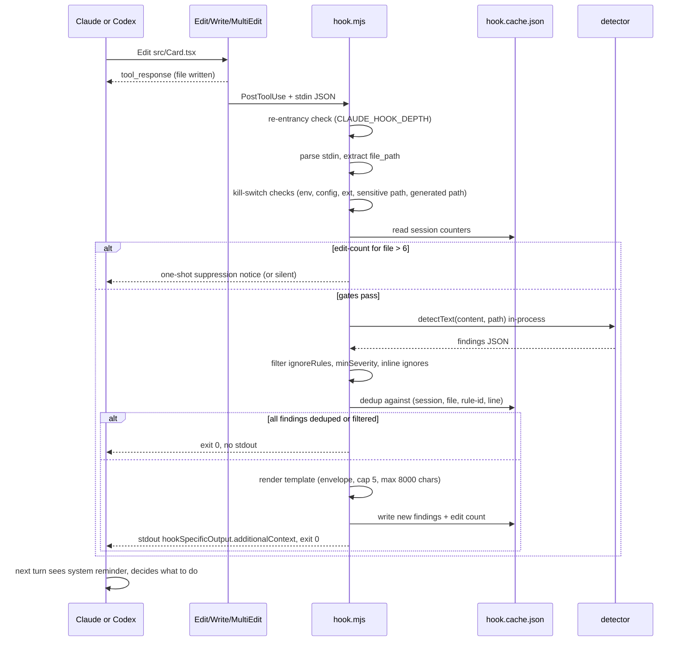

# PRD: Design detector hook (Claude Code + Codex)

| Field | Value |
|---|---|
| Status | Draft v2 (folded in online best-practices review) |
| Owner | TBD |
| Created | 2026-05-28 |
| Last revised | 2026-05-28 |
| Target version | Skill v3.2.0 (next minor) |
| Scope | Net-new feature, additive only |

### Changes since v1

- Exec form everywhere (Codex snippet was shell form), with the Windows `.cmd`/`.bat` rationale.
- Default `timeout` lowered from 10s to 5s; budget rationale tightened.
- Added re-entrancy guard (`CLAUDE_HOOK_DEPTH`) and per-file edit counter with suppression threshold.
- Session-scoped finding deduplication promoted from "open question" to v1 requirement.
- Inline ignore syntax now language-aware (HTML, JSX, CSS, JS each get their own comment shape).
- Hard-skip rules for sensitive paths (`.env`, `*.pem`, `id_rsa*`, `secrets*`, `credentials*`, `.git/`) and path traversal.
- Hard-skip rules for generated/lock files (`*.generated.*`, `*.d.ts`, lockfiles, minified output).
- Optional NDJSON audit log via `IMPECCABLE_HOOK_LOG`.
- Honest framing about Claude Code's lack of per-plugin hook disable.
- Honest framing about files written via `Bash` heredocs / redirects being invisible to v1.
- Codex: Windows-not-supported call-out and `[features].hooks = true` requirement.
- Findings cap dropped from 8 to 5 with attention-budget rationale.
- Versioned envelope (`[impeccable@1]`) prefix on rendered template.
- `effort`-aware suppression added as a v2 open question.

## 1. Summary

Ship a `PostToolUse` hook inside the Impeccable plugin so the existing design detector runs automatically after every relevant file write. Findings (if any) are fed back into the agent's context as a short system reminder so the model can course-correct on its next turn. The hook is silent on clean files and never blocks an edit.

Think of it as the spell-checker squiggle for AI-generated UI. The detector already catches 16 visual "AI tells" (side-tab borders, gradient text, icon-tile stacks, purple palette defaults, bounce easing, etc.). Today those only get caught when the user notices in review or runs `/impeccable audit` after the fact. The hook closes the loop at the moment the slop is written.

## 2. Goals and non-goals

### Goals

- Catch slop tells at the moment the agent writes them, not after the user notices in review.
- Keep the agent flow uninterrupted. Hook is purely advisory; the model decides whether to fix now or note for later.
- Ship to both Claude Code and Codex with a single shared hook script.
- Zero-friction install: enabling the plugin should be the only step on Claude Code.
- Document the one trust step Codex requires and the CI escape hatch.
- Stay under any context budget that might compete with the user's actual work.

### Non-goals

- Replacing `/impeccable audit` or `/impeccable critique`. Those remain the canonical full-coverage flows.
- Catching layout or computed-style rules. Those need a rendered page, not source files.
- Blocking edits. Even severe findings stay advisory in v1.
- Linting non-UI files. No Python, no Go, no markdown, no JSON.
- Supporting hooks on harnesses that do not have a hook system today (Cursor, Gemini, OpenCode, Kiro, etc.).
- Catching files written via the `Bash` tool (heredocs, redirects, codegen scripts). Documented limitation; see §3 "Tools that bypass the hook".
- Telemetry. No analytics, no counts shipped to any remote. The optional local NDJSON audit log (§5) stays on disk.

## 3. UX

### Default state

The hook is **on by default after install**, in **advisory mode only**. This was confirmed during planning: surprise is acceptable here because the hook is silent on clean files. Users see the hook only when there are real findings to act on.

### Trigger surface

- Event: `PostToolUse`.
- Tool matcher: `Edit | Write | MultiEdit` (Claude Code uses the literal `|`-separated form; Codex parses the same string as a regex).
- File filter: `.tsx`, `.jsx`, `.html`, `.vue`, `.svelte`, `.astro`, `.css`, `.scss`, `.less`, `.ts`, `.js`.
  - Claude Code: native `if: "Edit(*.{tsx,jsx,html,vue,svelte,astro,css,scss,ts,js})"` glob on the handler. The handler never spawns for non-matching files.
  - Codex: no `if:` analog. The hook script inspects the resolved file path and short-circuits before invoking the detector. Slightly more wasted process startups but fundamentally the same outcome.

### Silent pass

When the detector returns zero findings (the common case on most file writes), the hook emits **nothing on stdout** and **nothing as `systemMessage`**. The agent's next turn looks identical to a world with no hook. This is the most important UX guarantee in the whole feature.

### Findings present

When the detector returns one or more findings, the hook emits this single JSON object on stdout:

```json
{
  "hookSpecificOutput": {
    "hookEventName": "PostToolUse",
    "additionalContext": "<rendered template, see below>"
  }
}
```

The rendered template:

```
[impeccable@1] Design detector flagged 3 issue(s) in src/components/Card.tsx:
- L12 [side-tab] Side-tab accent border. Thick colored border on one side of a card, the most recognizable tell of AI-generated UIs. Use a subtler accent or remove it.
- L24 [gradient-text] Gradient text on body copy. Hurts readability and adds visual noise. Reserve gradients for short headlines or remove.
- L47 [icon-tile-stack] Icon tile above heading. The "feature card" pattern that screams AI. Try a horizontal layout or remove the tile.

Consider revising before continuing. Suppress: see §3 "Suppression schema" below for the per-language inline-ignore syntax. Run /impeccable audit for full coverage.
```

Rules for the rendered template:
- **Versioned envelope.** First line is always `[impeccable@1] …`. Lets future formats coexist with v1 parsers.
- **Cap at 5 findings** per file. Truncate with `... and N more (see /impeccable audit).` Attention falls off past 5–7 items for humans; models behave similarly. A smaller cap is also a stronger forcing function for the model to address rather than acknowledge.
- **Hard cap at 8000 characters** total. Leaves headroom under Claude Code's 10,000-char `additionalContext` limit and avoids the auto-spill-to-file behavior. Findings above 5 already lift more characters than they're worth.
- Each finding renders as one line in the form `- L<line> [<rule-id>] <name>. <description>`.
- Drop the `L<line>` prefix when line is unknown (`line: 0`).
- Description is rendered verbatim from the registry. We trust the existing wording.
- Same finding is **emitted at most once per session** (see §3 "Session-scoped deduplication" below).

### Tone

Informative, not directive. Words like "consider", "may want to", "if relevant". The model is not being told to drop everything and fix; it is being told what was detected so it can choose. This matches the user's framing during planning: "tell Claude there's design slop and let it course-correct".

### Surface to the user

Nothing in v1. The system reminder goes into the model's context only. No terminal output, no `systemMessage`, no `terminalSequence`. The user sees the consequence (the model addressing or acknowledging the finding on the next turn), not the mechanism.

Rationale: hooks fire constantly; piping anything to the user's terminal becomes spam fast. We rely on the model to surface what matters in its response.

### First-run education

A separate `SessionStart` hook prints one line of `additionalContext`, **gated by two checks** so it does not become tax on every session:

1. **Project probe.** Skip if the project has no scannable surface. Cheap detection: no `package.json` with a UI dep (`react`, `vue`, `svelte`, `@astrojs/*`, `next`, etc.) AND no `*.html` in the repo root or `src/`. If nothing is scannable, the hook will never fire anyway.
2. **Per-project throttle.** Show at most once per 30 days, tracked via `.impeccable/hook.cache.json` `lastEducationAt`. Returning users do not need the reminder.

When the gates pass, emit:

```
[impeccable@1] Design hook is active. Runs the design detector on .tsx/.jsx/.html/.css/etc. after every Write or Edit and reminds you (via system context) when known design anti-patterns appear. Disable per project: /impeccable hooks off. Disable globally: IMPECCABLE_HOOK_DISABLED=1.
```

This goes into the model's context, not the user's terminal, so the first time the user asks "why did Claude just mention design issues?" the model can answer accurately. We deliberately do not push a notification at the user.

### Kill switches (precedence high to low)

1. **Env var** `IMPECCABLE_HOOK_DISABLED=1`. Accepts `1`, `true`, `yes`, `on` (case-insensitive). For CI, one-off shells, headless runs.
2. **Project config** `.impeccable/hook.json` with `{ "enabled": false }`. Committed to the repo, applies to everyone working in it.
3. **Slash command** `/impeccable hooks off`. Toggles the project config above. Provides the friendly path.

`/impeccable hooks on` reverses it. `/impeccable hooks status` prints current state.

#### Why we need our own kill switch (the honest version)

Claude Code does not currently support disabling **only** a plugin's hooks while keeping its skills and commands. [Anthropic issue #57877](https://github.com/anthropics/claude-code/issues/57877) is explicitly **wontfix as of Apr 2026** ("plugins can only be enabled/disabled as a unit"). So the platform-provided escape hatches are:

- Disable the entire Impeccable plugin: loses 23 useful slash commands. Too coarse.
- `disableAllHooks: true` in `.claude/settings.json`: silences **every** hook from every plugin and every user-defined hook the user wrote themselves. Almost always overshoots.
- Fork the plugin: user-hostile.

Our `.impeccable/hook.json` `{ "enabled": false }` and the `/impeccable hooks off` slash command are the **workaround** for this missing platform feature, not nice-to-haves. If Anthropic ships proper per-plugin hook disable later, we should redirect users at it and deprecate the JSON toggle. See open question 7 for the `${user_config.*}` migration path.

### Suppression schema (`.impeccable/hook.json`)

```jsonc
{
  // Default true. Single switch for the whole hook.
  "enabled": true,

  // Skip findings for these rule ids entirely.
  "ignoreRules": ["repeated-section-kickers"],

  // Skip files matching any of these globs. Combined with the built-in skip list (see §5 Path safety).
  "ignoreFiles": ["src/legacy/**", "**/*.generated.tsx"],

  // Minimum severity to surface. "warning" (default) shows all; "advisory" hides advisory-only rules.
  "minSeverity": "warning",

  // Limits for the rendered template. Defaults shown.
  "limits": { "maxFindings": 5, "maxChars": 8000 }
}
```

#### Inline ignores (per-language syntax)

Different file types need different comment syntaxes. The hook recognizes all four shapes; an ignore directive applies to the **next non-blank line** so scope is unambiguous.

| File type | Syntax |
|---|---|
| `.html`, `.vue` template, `.svelte` markup, `.astro` markup | `<!-- impeccable: ignore <rule-id> -->` |
| `.jsx`, `.tsx` JSX expressions | `{/* impeccable: ignore <rule-id> */}` |
| `.css`, `.scss`, `.less` | `/* impeccable: ignore <rule-id> */` |
| `.ts`, `.js` (and `.vue`/`.svelte` script blocks) | `// impeccable: ignore <rule-id>` |

To suppress all rules on the next line use `impeccable: ignore *`. Conventions match ESLint, Stylelint, and Biome so they are familiar. Detection is line-based string match — comments inside template literals will still match, which is a small false-positive risk we accept for v1.

This complements (does not replace) the free-form `.impeccable/critique/ignore.md` pattern documented in [`skill/reference/critique.md`](../skill/reference/critique.md); critique uses LLM-aware filtering, the hook needs a parserless local check.

### Session-scoped deduplication

The hook fires on every `Edit`/`Write`/`MultiEdit`. Without dedup, the same finding lands in the model's context window over and over. Empirically (per [anthropics/claude-code#25327](https://github.com/anthropics/claude-code/issues/25327) and the "context-window tax" literature) a ~250-token `additionalContext` payload echoed across 50 tool calls is ~12.5K wasted tokens per session.

**v1 dedup rules:**

- Keyed by `(session_id, file, rule-id, line)`. Same key in the same session → suppress.
- If the line shifts (model edits above the finding), the new key emits as a fresh signal — that is correct, the location moved.
- Cache lives at `${CLAUDE_PROJECT_DIR}/.impeccable/hook.cache.json`, keyed by `session_id`, with a rolling window of the last 8 sessions garbage-collected on read.
- Cache is writable on every fire; failure to write is swallowed (dedup degrades to "off this turn", which is acceptable).

The cache also powers two ancillary features in v1:

- **Per-(session, file) edit counter.** After 6 edits to the same file in a session, suppress that file's findings for the rest of the session and emit a one-shot `[impeccable@1] Suppressing further findings on src/Card.tsx — 6 edits in session; run /impeccable audit to revisit.` This is the loop-detector pattern from [AgentPatterns.ai](https://agentpatterns.ai/agent-readiness/bootstrap-loop-detector-hook/) adapted to advisory mode.
- **First-run education throttle** (see "First-run education" above).

### Tools that bypass the hook (known limitations)

The `Edit | Write | MultiEdit` matcher does **not** catch:

- `Bash` heredocs (`cat > file.tsx <<'EOF' … EOF`).
- `Bash` redirects (`sed -i …`, `printf … >> file.css`).
- Codegen scripts the agent runs (`node scripts/gen-component.mjs`).
- `NotebookEdit` (Impeccable doesn't care about notebooks).

For v1 we ship this as a known gap and document it in the install README. The honest framing: "if the agent went through Edit/Write/MultiEdit, we caught it; if it ran a shell command, we didn't."

**v2 path** (deferred): add a second `PostToolUse` handler matched on `Bash` whose script runs `git status --porcelain` to find scannable files modified by the last shell command, then runs the detector across them. Cheaper than it sounds — git status on a typical repo is sub-10ms. Tracked in open question 4.

## 4. Hook flow



### Tool payload shapes the hook handles

| Tool | Fires PostToolUse | Payload shape relevant to us |
|---|---|---|
| `Edit` | Yes | `tool_input.file_path` + `old_string` + `new_string`. Single file. |
| `Write` | Yes | `tool_input.file_path` + `content`. Single file, full overwrite. |
| `MultiEdit` | Yes, **once per call** (not per edit) | `tool_input.file_path` + `edits[]`. Same single file, multiple in-place patches. Hook runs once against final file state. |
| `apply_patch` (Codex) | Yes, once per patch | `tool_input.file_path` + `tool_input.command`. We read `file_path`; the patch already applied. |
| `Bash` | Yes, but we **do not match it** in v1 | `tool_input.command`. See §3 "Tools that bypass the hook". |
| `NotebookEdit` | Yes, but we do not match it | Not in scope. |

## 5. Technical design

### Hook script

One file, `skill/scripts/hook.mjs`. Shared between Claude Code and Codex. Sketch (production version will be ~150 lines):

```js
#!/usr/bin/env node
import fs from "node:fs";
import path from "node:path";

const ALLOWED_EXTS = new Set([
  ".tsx", ".jsx", ".html", ".vue", ".svelte", ".astro",
  ".css", ".scss", ".less", ".ts", ".js",
]);

// S6: hard-skip sensitive files even if extension matches.
const SENSITIVE_PATH = /(?:^|\/)(?:\.env(?:\.|$)|.*\.pem$|id_rsa.*|.*secret.*|.*credential.*|\.git\/.*)/i;

// S12: skip generated/lock/minified files.
const GENERATED_PATH = /(?:\.generated\.[a-z]+$|\.d\.ts$|\.min\.[a-z]+$|node_modules\/|\/(?:dist|build|out|\.next|\.cache|coverage)\/|\.lock(?:\.json)?$)/i;

const TRUTHY = /^(1|true|yes|on)$/i;

async function main() {
  try {
    // S3: re-entrancy guard. If we're inside another hook's spawn tree, bail.
    if (process.env.CLAUDE_HOOK_DEPTH || process.env.IMPECCABLE_HOOK_DEPTH) return;
    process.env.IMPECCABLE_HOOK_DEPTH = "1";

    // S13: tolerant truthy parsing.
    if (process.env.IMPECCABLE_HOOK_DISABLED && TRUTHY.test(process.env.IMPECCABLE_HOOK_DISABLED)) return;

    const stdin = await readStdin();
    const event = JSON.parse(stdin);

    // S7: handle Edit / Write / MultiEdit / apply_patch payload shapes uniformly.
    const filePath = event?.tool_input?.file_path;
    if (!filePath || typeof filePath !== "string") return;

    // S6: path traversal + sensitive-file gate.
    if (filePath.includes("..") || SENSITIVE_PATH.test(filePath)) return;

    // S12: generated / lock / build output gate.
    if (GENERATED_PATH.test(filePath)) return;

    const ext = path.extname(filePath).toLowerCase();
    if (!ALLOWED_EXTS.has(ext)) return;

    const cwd = event.cwd || process.cwd();
    const config = readConfig(cwd); // tolerant: malformed JSON → defaults
    if (config.enabled === false) return;
    if (matchesAny(filePath, config.ignoreFiles)) return;
    if (!fs.existsSync(filePath)) return;

    // S3 / S4: edit counter + dedup cache.
    const cache = readCache(cwd);
    const sessionId = event.session_id || "unknown";
    const editCount = bumpEditCount(cache, sessionId, filePath);
    if (editCount > 6) {
      // One-shot suppression notice the first time we cross the threshold; silent after.
      if (editCount === 7) {
        return emit(suppressionNotice(filePath));
      }
      return;
    }

    const { detectText, detectHtml } = await import("./detector/detect-antipatterns.mjs");
    const content = fs.readFileSync(filePath, "utf-8");
    const findings = (ext === ".html" || ext === ".htm")
      ? detectHtml(filePath)
      : detectText(content, filePath);

    const filtered = applyFilters(findings, content, config); // rule, severity, inline-ignore
    const fresh = dedupeAgainstCache(filtered, cache, sessionId, filePath);

    if (fresh.length === 0) return;

    persistCache(cache, sessionId, filePath, fresh);
    writeAuditLog(cwd, { sessionId, filePath, count: fresh.length });

    const text = renderTemplate(fresh, filePath, config); // envelope, cap 5, max 8000 chars
    emit(text);
  } catch (err) {
    // Advisory contract: never break a turn because the linter crashed.
    if (process.env.IMPECCABLE_HOOK_DEBUG) console.error("[impeccable-hook]", err);
    writeAuditLog(process.cwd(), { error: String(err) });
  }
}

function emit(text) {
  process.stdout.write(JSON.stringify({
    hookSpecificOutput: { hookEventName: "PostToolUse", additionalContext: text },
  }));
}

main();
```

Notes on the script:

- **In-process import.** Importing `detectText` / `detectHtml` directly avoids the ~150ms cost of spawning `npx impeccable detect`. Module cache reuse across calls is **not** a win here because every PostToolUse fires a fresh `node` process (see §5 Performance budget).
- **Relative import path.** `./detector/detect-antipatterns.mjs` works because the build copies the engine tree into `skills/impeccable/scripts/detector/`, the same pattern `skill/scripts/detect.mjs` already uses.
- **Fail-open contract.** All errors are swallowed; exit 0 always. This is the right tradeoff for advisory tooling but the wrong one for security gates. We accept the trade because the cost of a missed slop tell is far smaller than the cost of a crashed hook freezing every edit.
- **No network, no spawn, no file watchers.** Only `import()` and `readStdin()` are async.
- **Re-entrancy guard.** `IMPECCABLE_HOOK_DEPTH=1` is exported in the script's own process env (not the parent's) so any child process the hook ever spawns sees it. Belt-and-suspenders even though v1 spawns nothing.

### `hook.json` filter helpers

The script does its own minimal config read so it stays a single file with no extra deps. Parsing config and applying glob ignores is ~30 lines of vanilla JS; no need to pull a glob library, since user-supplied globs can be matched with the existing pattern utilities already present in the engine.

### Path safety

Two layered defenses:

1. **Hard-skip regexes** in the hook (`SENSITIVE_PATH`, `GENERATED_PATH`, traversal check). Run before the file is even read. These cannot be turned off via config — they exist to prevent the hook from being repurposed as an inadvertent file-content exfiltration channel.
2. **User-extensible `ignoreFiles`** in `.impeccable/hook.json`. Layered on top of the hard skips for project-specific paths.

The hook never reads file content until after both gates pass. The official Anthropic reference [validate-write.sh](https://github.com/anthropics/claude-code/blob/main/plugins/plugin-dev/skills/hook-development/examples/validate-write.sh) treats this kind of skip list as table stakes; we are following the same pattern.

### Claude Code wiring

Build emits `plugin/hooks/hooks.json` (auto-discovered by Claude Code; do **not** also list it in `plugin/.claude-plugin/plugin.json` or Claude Code throws `Duplicate hooks file detected`, per [anthropics/claude-code#103](https://github.com/affaan-m/everything-claude-code/issues/103)).

Schema:

```json
{
  "description": "Impeccable design detector: run after Write/Edit, surface findings as system reminders.",
  "hooks": {
    "PostToolUse": [
      {
        "matcher": "Edit|Write|MultiEdit",
        "hooks": [
          {
            "type": "command",
            "command": "node",
            "args": ["${CLAUDE_PLUGIN_ROOT}/skills/impeccable/scripts/hook.mjs"],
            "if": "Edit(*.{tsx,jsx,html,vue,svelte,astro,css,scss,ts,js})",
            "timeout": 5
          }
        ]
      }
    ],
    "SessionStart": [
      {
        "hooks": [
          {
            "type": "command",
            "command": "node",
            "args": ["${CLAUDE_PLUGIN_ROOT}/skills/impeccable/scripts/hook-session-start.mjs"],
            "timeout": 3
          }
        ]
      }
    ]
  }
}
```

**Why exec form (`command` + `args`), not shell form**: the [official reference](https://code.claude.com/docs/en/hooks.md) explicitly recommends exec form for any hook that references a path placeholder, because each `args` element is passed as one argument with no shell tokenization. On Windows, shell form additionally breaks because `.cmd` / `.bat` shims for `node_modules/.bin` tools cannot be spawned without a shell. The `node` + script-path combination works identically on macOS, Linux, and Windows.

### Codex wiring

Codex needs two things:

1. `.codex-plugin/plugin.json` declaring the plugin. (Repo does not have this today; net-new file.)
2. `hooks/hooks.json` discoverable from the plugin root. Same script, **exec form** like Claude Code:

```json
{
  "description": "Impeccable design detector",
  "hooks": {
    "PostToolUse": [
      {
        "matcher": "Edit|Write|apply_patch",
        "hooks": [
          {
            "type": "command",
            "command": "node",
            "args": ["${PLUGIN_ROOT}/skills/impeccable/scripts/hook.mjs"],
            "timeout": 5
          }
        ]
      }
    ]
  }
}
```

Notes on Codex specifics:

- **`PLUGIN_ROOT` is Codex's native placeholder**; Codex also exports `CLAUDE_PLUGIN_ROOT` for compatibility. We use `PLUGIN_ROOT` in the Codex `hooks.json` because that is the documented Codex placeholder and the right surface for an open-source project that does not want to look Claude-branded inside Codex configs.
- **Feature flag**: Codex still ships hooks behind `[features].hooks = true` in `config.toml` (or `[features] codex_hooks = true` on older builds — Codex names have shifted; verify against the version the user is on). Install README must call this out.
- **Windows is not supported.** Per the [Codex docs](https://developers.openai.com/codex/hooks) and confirmed in the rust-v0.124.0 release notes, hooks are disabled on Windows. v1 ships Codex hooks on macOS and Linux only.
- **No `if:` glob analog.** The hook script does the extension filter (already required for the kill switches and path safety, so this is "free").
- **Trust ceremony.** Every change to the hook definition revokes Codex's trust hash and requires another `/hooks` review. Plugin updates that touch the hook script trigger this. Install README must explain this so users do not silently lose the hook after `npm update`.

### Build pipeline changes

- Add `emitHooks: true` and `emitCodexPlugin: true` to the relevant entries in [`scripts/lib/transformers/providers.js`](../scripts/lib/transformers/providers.js):
  - `claude-code`: `emitHooks: 'claude'`
  - `codex`: `emitHooks: 'codex'`, `emitCodexPlugin: true`
  - `agents` (Codex CLI install target): `emitHooks: 'codex'`
- Add a `writeHooks(skillsDir, providerConfig)` helper in [`scripts/lib/transformers/factory.js`](../scripts/lib/transformers/factory.js) that renders the right `hooks.json` template per provider.
- Track output files in git:
  - `plugin/hooks/hooks.json` (slim plugin subtree, already tracked)
  - `.agents/hooks/hooks.json` (new)
  - `.codex-plugin/plugin.json` (new)
- Update `scripts/build.js` validators if needed to skip these files in count checks.

### Failure modes

| Failure | Behavior |
|---|---|
| Detector throws | Swallow, exit 0, no output. With `IMPECCABLE_HOOK_DEBUG=1`, log to stderr. Audit log records `{ error }`. |
| File not found | Exit 0, no output. (Race conditions with the tool can leave the file briefly unreadable.) |
| Stdin malformed JSON | Exit 0, no output. |
| Config malformed | Treat as default config, continue. Audit log records `{ configError: true }`. |
| Detector takes too long | Hard timeout 5s in `hooks.json`. Hook is killed; agent continues uninterrupted. Audit log misses this run (no exit). |
| Output exceeds 8000 chars | Truncate finding list and add `... and N more.` trailer. |
| Re-entrancy detected | Bail immediately. Audit log records `{ reentrant: true }`. |
| Cache write fails (disk full, readonly fs) | Dedup degrades to "off this turn"; findings still emit. Audit log records `{ cacheError: true }`. |
| Sensitive path / generated path / traversal | Silent skip before reading file. Audit log records `{ skipped: 'sensitive' }` etc. |

### Performance budget

| Step | Mac/Linux | Windows |
|---|---|---|
| Cold Node start | 50–80 ms | 200–400 ms (Defender SmartScreen) |
| Stdin parse | <1 ms | <1 ms |
| Config + cache read | ~5 ms | ~10 ms |
| Detector regex pass (~500-line `.tsx`) | ~30 ms | ~40 ms |
| Render + emit | <1 ms | <1 ms |
| **Realistic p95** | **~120 ms** | **~400 ms** |
| **Hard ceiling (hook timeout)** | **5 s** | **5 s** |

Notes:
- Every `PostToolUse` spawns a fresh `node` process. No in-process module cache reuse across calls. The "in-process detector import" saves the cost of resolving `npx impeccable`, not the cost of loading the engine module.
- v1 ships **sync, blocking**. If real-world Windows p95 exceeds 1s and starts feeling laggy, v2 switches to Claude Code's `async: true` (fire-and-forget — loses ability to inject context) or `asyncRewake: true` (background + wake on exit 2 — keeps context injection, but at the cost of an extra agent turn). Both are skill-version-bumped enhancements. Codex does **not** have async hooks yet (parsed but not supported), so Codex stays sync regardless.

### Observability

Optional opt-in NDJSON audit log to diagnose silent failures:

```bash
export IMPECCABLE_HOOK_LOG="$HOME/.impeccable/hook.ndjson"
```

When set, the hook appends one line per fire:

```json
{"ts":"2026-05-28T09:30:12Z","session":"01h…","event":"PostToolUse","file":"src/Card.tsx","ext":".tsx","findings":3,"freshFindings":2,"editCount":1,"emitted":true,"durationMs":48}
{"ts":"2026-05-28T09:30:14Z","session":"01h…","event":"PostToolUse","file":"src/App.tsx","skipped":"sensitive","durationMs":1}
```

Reasoning: the [single most-cited gotcha](https://dev.to/redpa/your-claude-code-hooks-probably-fail-open-heres-why-thats-dangerous-2nfi) for advisory hooks in production is "the guard quietly stopped working and nobody noticed". The audit log answers "did the hook run? did it emit anything?" without forcing the user to enable `claude --debug`. Off by default to avoid disk-space surprises; documented in the install README.

## 6. Distribution

### Claude Code

Auto-installed when the user enables the plugin via marketplace. Zero extra steps. The hook is bundled inside `plugin/hooks/hooks.json` and runs from `${CLAUDE_PLUGIN_ROOT}`.

### Codex

**Supported: macOS and Linux only in v1.** Codex hooks are explicitly disabled on Windows (per the [Codex docs](https://developers.openai.com/codex/hooks) and the rust-v0.124.0 release notes). Windows users still get the Impeccable skill and slash commands; just no hook.

Setup is three steps the first time:

1. Enable the feature flag (one-time, per machine):
   ```toml
   # ~/.codex/config.toml
   [features]
   hooks = true
   ```
2. Approve the hook:
   ```
   $ codex
   > /hooks
   [review and trust Impeccable's PostToolUse hook]
   ```
3. After any Impeccable plugin update that changes the hook script (most updates), Codex revokes trust and re-requires `/hooks`. Install README must call this out so users do not silently lose the hook after `npm update`.

For CI / headless runs, document the `--dangerously-bypass-hook-trust` flag (merged 2026-05-13 in [openai/codex#21768](https://github.com/openai/codex/pull/21768)). The name is intentionally alarming; treat it as opt-in for trusted CI only.

### Other harnesses

Cursor, Gemini, OpenCode, Kiro, Pi, Qoder, Trae, RovoDev: **no hook integration in v1**. None of these have a documented hook surface today. The README and [`HARNESSES.md`](../HARNESSES.md) explicitly call this out so we do not oversell. When (if) those harnesses ship hooks, we revisit.

### Install README updates

- Add a "Design hook" subsection to the main README explaining what it does, default behavior, and how to disable.
- Add a Codex-specific note about the trust step.
- Mention the `.impeccable/hook.json` schema with a copyable example.

## 7. Coverage tradeoffs (the honest gap section)

The hook covers a slice of the rule set, by design. Be explicit about what's in and what's out.

### Rule coverage (engine-level)

The hook reads source files and runs the regex engine. That covers the **slop** category (~16 of 29 rules). The **quality** category — `low-contrast`, `cramped-padding`, `nested-cards`, `icon-tile-stack` on rendered components, `flat-type-hierarchy` at page level — requires a rendered DOM with computed styles. None of those fire in the hook; they remain the domain of `/impeccable audit` (HTML / dev-server URL) and `/impeccable critique`.

### Tool coverage (event-level)

The hook only fires on `Edit | Write | MultiEdit` (Claude Code) and `Edit | Write | apply_patch` (Codex). Files written by the agent via `Bash` (heredocs, redirects, codegen scripts) are **invisible** in v1. See §3 "Tools that bypass the hook" for the full list and the v2 path (a separate `Bash` matcher that diffs `git status --porcelain`).

### Platform coverage

- Claude Code: macOS, Linux, Windows.
- Codex: macOS, Linux only (hooks disabled on Windows in current Codex builds).
- All other harnesses (Cursor, Gemini, OpenCode, Kiro, Pi, Qoder, Trae, RovoDev): no hook surface today, no coverage.

### How we position it

- **Hook**: first line of defense against slop. Fast, silent, advisory. ~55% rule coverage on the file types it sees, 0% on Bash-written files. Free.
- **`/impeccable audit`**: full rule coverage including layout and a11y, runs on built HTML or a dev-server URL. Done before shipping.
- **`/impeccable critique`**: deep UX review with personas and scoring. Done at meaningful milestones.

The rendered template ends with `Run /impeccable audit for full coverage.` so the model knows what the deeper option is.

## 8. Open questions

These do not block the PRD or the implementation, but they need an answer somewhere along the way.

### Closed in this revision (formerly open)

- ~~Session-scoped dedup cache?~~ → **Yes, v1 requirement.** Promoted to §3 "Session-scoped deduplication".
- ~~Inline-ignore syntax?~~ → **Per-language map, v1.** See §3 "Inline ignores".
- ~~Audit log?~~ → **Opt-in NDJSON, v1.** See §5 "Observability".
- ~~Path-safety hard-skip rules?~~ → **Yes, baked into the hook, v1.** See §5 "Path safety".
- ~~Re-entrancy guard?~~ → **Yes, `IMPECCABLE_HOOK_DEPTH`, v1.**

### Still open

1. **Bash-written files: ignore or scan via `git status --porcelain`?** v1 ignores; v2 should pick. The honest answer probably depends on how often agents reach for `Bash` writes in practice; instrument the audit log to find out.
2. **`/impeccable hooks` as the 24th sub-command, or hidden command?** It is plumbing, not a design skill. Lean **hidden** (i.e. routed but not advertised in the main 23) so we keep the skill's "23 commands" identity. The build counts commands from the router table; we can mark it `hidden: true` in the metadata.
3. **Should we expose `--strict` mode in v2 that blocks on severe a11y findings?** Probably yes for opinionated teams, no by default. Defer.
4. **PostToolBatch on Claude Code for large MultiEdit operations?** `MultiEdit` already fires once per call. The real batching candidate is sequential `Edit` calls across many files in one turn (e.g. a refactor). v2.
5. **Should the hook ever inject a positive signal (e.g. "no design issues found in 12 files this session, nice")?** Adds happy-path noise to the model's context. Lean **no**.
6. **Subagent context budget.** Subagents inherit hooks but have tighter context windows. If `effort` is `low` or the hook input's `subagent` field is set, drop the finding cap from 5 to 3.
7. **Migrate `enabled` to `${user_config.*}` when Anthropic ships it.** [Issue #39455](https://github.com/anthropics/claude-code/issues/39455) tracks Claude Code's `userConfig` mechanism becoming reliable. Once it does, we can expose `${user_config.hook_enabled}` directly in `hooks.json` and let users toggle through the plugin UI, deprecating `.impeccable/hook.json` `enabled`. Per-rule ignores and per-file ignores still need the JSON file.
8. **`effort`-aware suppression.** The `PostToolUse` payload includes `effort.level` (`low`/`medium`/`high`/`xhigh`/`max`). At the top tiers the model presumably already knows what slop looks like. Suppressing reminders at `xhigh`+ might cut tokens for the users who need it least. Opinionated; defer.
9. **Per-rule severity overrides.** Some users will want side-tab as a critical signal, others as a friendly nudge. The current schema has `minSeverity` but not per-rule severity. Defer to v2.
10. **Session-end summary via `Stop` hook.** A one-shot "5 findings flagged across 12 files this session; 4 addressed" at turn boundaries closes the feedback loop nicely. Pairs with the dedup cache. v2.

## 9. Rollout

| Step | Branch | Notes |
|---|---|---|
| 1. PRD | `feature/design-hook-prd` (this branch) | Approve before implementation. |
| 2. Implementation | `feature/design-hook-impl` | Hook script, build pipeline, config schema, tests. |
| 3. Skill version bump to 3.2.0 | same branch as impl | Per the release policy in [`CLAUDE.md`](../CLAUDE.md). Update `.claude-plugin/plugin.json`, `.claude-plugin/marketplace.json`, and the homepage changelog. |
| 4. Update [`HARNESSES.md`](../HARNESSES.md) | same branch | Flip Claude Code and Codex hook columns from "documented but unused" to "implemented". |
| 5. v2 enhancements | follow-up | Async mode, PostToolBatch batching, optional strict mode. |

## 10. Test plan

For the implementation branch, not this one.

### Unit tests (Bun test)

- **Happy path**: stdin with a known fixture, returns `hookSpecificOutput` with the expected envelope and finding lines.
- **Kill switches**: env var (`1`/`true`/`yes`/`on` case-insensitive), config-file `enabled: false`, project-glob ignore, extension not in allowlist. Each must silently exit 0 with no stdout.
- **Path safety**: `.env`, `.env.production`, `id_rsa`, `secrets/api.json`, `.git/config`, `../../etc/passwd`. Each must skip before reading the file. Audit log records `skipped`.
- **Generated/lock skips**: `*.generated.tsx`, `*.d.ts`, `pkg.lock.json`, `dist/Card.tsx`, `node_modules/lib.tsx`. Each must skip.
- **Filter logic**: `ignoreRules`, `minSeverity`, inline ignores per language (HTML, JSX, CSS, JS). Each emits the expected subset.
- **Inline-ignore scope**: directive on line 10, finding on line 11 → suppressed; finding on line 13 → emitted.
- **Output cap**: 12 findings collapse to `[impeccable@1]` envelope + 5 lines + `... and 7 more (see /impeccable audit).`; oversize string clamps to 8000 chars.
- **Versioned envelope**: every emitted payload starts with `[impeccable@1] `.
- **Session dedup**: same file + rule + line on two consecutive calls → first emits, second silent. Line shift → both emit.
- **Edit counter**: 6 edits to same file emit normally; 7th emits one-shot suppression notice; 8th silent.
- **Re-entrancy**: `IMPECCABLE_HOOK_DEPTH=1` in env → silent exit.
- **MultiEdit shape**: payload with `tool_input.file_path` + `edits[]` runs once, reads final file state, emits at most once.
- **apply_patch shape**: Codex-style payload extracts `tool_input.file_path` correctly.
- **Error swallowing**: detector throws, config malformed, cache write fails (readonly fs), file disappears mid-run. All exit 0; audit log records the failure mode.

### Integration tests (Node test)

- Build pipeline produces expected hook artifacts: `plugin/hooks/hooks.json`, `.agents/hooks/hooks.json`, `.codex-plugin/plugin.json`.
- Generated `hooks.json` parses as valid Claude Code and Codex hook schemas.
- Hook script in each harness directory imports the detector correctly from its relative path on macOS, Linux, **and Windows** (CI matrix).
- Audit log file is created on first append, gets one valid NDJSON line per fire, and survives session restart.

### Manual / live-mode tests

- Spin up a scratch repo, install via `npx impeccable skills install`, configure Claude Code, edit a fixture file with a side-tab border. Confirm the model references the finding on the next turn.
- Re-edit the same file (no new findings). Confirm dedup kicks in: no second reminder for the same finding.
- Edit 7 different files with findings, then re-edit the first one a 7th time. Confirm the suppression notice fires once on the 7th edit and nothing on the 8th.
- Add `// impeccable: ignore side-tab` above the offending line in a `.tsx` file. Re-edit. Confirm the finding is now suppressed and other rules still fire.
- Same flow on Codex after the `[features].hooks = true` + `/hooks` trust step.
- Disable via `/impeccable hooks off`; confirm the next edit produces no system reminder.
- Enable `IMPECCABLE_HOOK_LOG`; confirm the NDJSON file gets the expected fields.

### Regression

- Run the existing `bun run test`, `bun run test:live-e2e`, and `bun run build` to confirm nothing else broke.
- Confirm the count-validators in `scripts/build.js` still pass.
- Confirm `npx impeccable skills install` continues to work on all 13 harness directories.

## 11. Decision log (to fill during implementation)

| Date | Decision | Rationale |
|---|---|---|
| 2026-05-28 | Advisory only, no blocking | Per planning conversation; matches the "course-correct" framing. |
| 2026-05-28 | Default on, design-files only | Per planning conversation; lowest surprise + highest value tradeoff. |
| 2026-05-28 | Single hook script for both harnesses | Reduces drift; Codex env vars are aliased to Claude's for compat. |
| 2026-05-28 | In-process detector import, not subprocess | Saves the ~150ms `npx impeccable` resolution cost per call. |
| 2026-05-28 | Exec form everywhere (`command` + `args`) | Official Claude Code recommendation; only form that works on Windows with `.cmd`/`.bat` shims; safe against shell tokenization of paths with spaces. |
| 2026-05-28 | Timeout 5s on PostToolUse, 3s on SessionStart | Community consensus (Claude Code Guides, systemprompt.io, Dotzlaw) is 2–5s ceiling. 10s gives a hung detector enough headroom to feel laggy. |
| 2026-05-28 | Re-entrancy guard via `IMPECCABLE_HOOK_DEPTH` | Belt-and-suspenders even though v1 spawns nothing. The pattern is universally recommended for any hook that might ever shell out. |
| 2026-05-28 | Session-scoped dedup as v1 requirement | Token-tax math (~12.5K wasted per chatty session) makes this a v1 must, not an open question. |
| 2026-05-28 | Per-language inline-ignore syntax | HTML comments don't parse in `.tsx`/`.css`/`.js`; matching ESLint/Stylelint/Biome conventions is what users expect. |
| 2026-05-28 | Hard-skip sensitive paths and generated files | Defense in depth (sensitive) and noise reduction (generated). Cannot be turned off from config. |
| 2026-05-28 | Findings cap dropped from 8 to 5 | Attention falls off past 5–7 items; smaller cap is also a stronger forcing function. |
| 2026-05-28 | Versioned envelope `[impeccable@1]` | Future-proofs the rendered template against format evolution. |
| 2026-05-28 | Bash-written files ignored in v1 (documented limitation) | Adding a `Bash` matcher means a `git status` shell-out per Bash call; defer the cost/benefit call until we have audit-log data. |
| 2026-05-28 | Codex Mac/Linux only in v1 | Codex disables hooks on Windows; ship what works, document the gap. |
| 2026-05-28 | NDJSON audit log opt-in, off by default | Disk-space safety; the failure mode it addresses ("hook silently stopped") matters enough to provide the option, not common enough to default on. |
| TBD | `/impeccable hooks` hidden vs visible | Open question 2. |
| TBD | Bash blind spot policy | Open question 1. |
| TBD | Output size policy under subagents | Open question 6. |
| TBD | `effort`-aware suppression | Open question 8. |

## Appendix A: Sample stdin payloads

### Claude Code `PostToolUse` after `Edit`

```json
{
  "session_id": "01h...",
  "transcript_path": "/Users/me/.claude/projects/.../transcript.jsonl",
  "cwd": "/Users/me/myapp",
  "permission_mode": "default",
  "hook_event_name": "PostToolUse",
  "effort": { "level": "medium" },
  "tool_name": "Edit",
  "tool_input": {
    "file_path": "/Users/me/myapp/src/components/Card.tsx",
    "old_string": "...",
    "new_string": "..."
  },
  "tool_use_id": "toolu_01...",
  "tool_response": { "type": "tool_result", "content": "..." },
  "duration_ms": 42
}
```

### Claude Code `PostToolUse` after `MultiEdit`

```json
{
  "session_id": "01h...",
  "cwd": "/Users/me/myapp",
  "permission_mode": "default",
  "hook_event_name": "PostToolUse",
  "tool_name": "MultiEdit",
  "tool_input": {
    "file_path": "/Users/me/myapp/src/components/Card.tsx",
    "edits": [
      { "old_string": "...", "new_string": "..." },
      { "old_string": "...", "new_string": "..." }
    ]
  },
  "tool_use_id": "toolu_01...",
  "tool_response": { "type": "tool_result", "content": "..." }
}
```

The hook reads `file_path` and the **final** content from disk — not the individual edits — so it sees what the model actually committed.

### Codex `PostToolUse` after `apply_patch`

```json
{
  "session_id": "...",
  "turn_id": "...",
  "transcript_path": "...",
  "cwd": "/Users/me/myapp",
  "hook_event_name": "PostToolUse",
  "model": "claude-sonnet-4-6",
  "tool_name": "apply_patch",
  "tool_use_id": "...",
  "tool_input": {
    "file_path": "/Users/me/myapp/src/components/Card.tsx",
    "command": "*** Update File: src/components/Card.tsx\n..."
  },
  "tool_response": "Patched."
}
```

The hook script reads `tool_input.file_path` from all four shapes (`Edit`, `Write`, `MultiEdit`, `apply_patch`) identically.

### What we do NOT see: `Bash` write

```json
{
  "hook_event_name": "PostToolUse",
  "tool_name": "Bash",
  "tool_input": {
    "command": "cat > src/components/Card.tsx <<'EOF'\nexport function Card() { return <div className=\"border-l-4 border-purple-500\" />; }\nEOF"
  },
  "tool_response": { "stdout": "", "stderr": "", "exit": 0 }
}
```

The agent just wrote a textbook side-tab finding and our v1 hook silently misses it. See §3 "Tools that bypass the hook" for the v2 path.

## Appendix B: Why not use the detector's CLI subprocess

The detector already supports `npx impeccable detect --fast --json <file>` and stdin `{ tool_input: { file_path } }`. Tempting to just wire that into the hook command directly. We are not, because:

1. **Cold start cost.** Spawning `node` + resolving `npx impeccable` adds ~150ms per call on a fast machine and more on slower ones. On a chatty editing session that is noticeable.
2. **Output channel mismatch.** The CLI prints findings to stderr in text mode and stdout in JSON mode. Hooks expect a single, well-formed JSON object on stdout. Putting a JSON-shaping layer in front of the CLI means a shell script and two processes per call. Just calling the engine directly is cleaner.
3. **Exit code mismatch.** The CLI exits 2 on findings. Hooks should always exit 0 unless they want to actively block. Wrapping the CLI requires translating exit codes.
4. **No need.** The detector is already designed as an importable ES module. Importing it directly is the documented programmatic API and is what the in-repo critique flow does.

## Appendix C: Why not `/impeccable polish` or `/impeccable audit` invocation

The hook could call an LLM via the `prompt` or `agent` handler type on Claude Code (Codex parses but does not yet support these). It could ask Claude to "review this file for design issues". We are deliberately not doing that:

1. Cost. Every file write would trigger an LLM call. Even at Haiku-tier pricing this adds up.
2. Latency. A hidden LLM call on every edit makes the agent feel sluggish for no visible reason.
3. Noise. LLM judgments will vary across calls; the user gets inconsistent feedback for similar edits.
4. The existing sub-commands (`/impeccable audit`, `/impeccable critique`, `/impeccable polish`) already do exactly this with proper UX scaffolding. The hook is the cheap deterministic check that runs constantly; the sub-commands are the rich review that the user invokes deliberately.

The hook should remain a deterministic lint, not a tiny LLM in the background.
