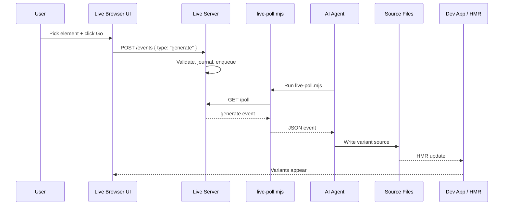
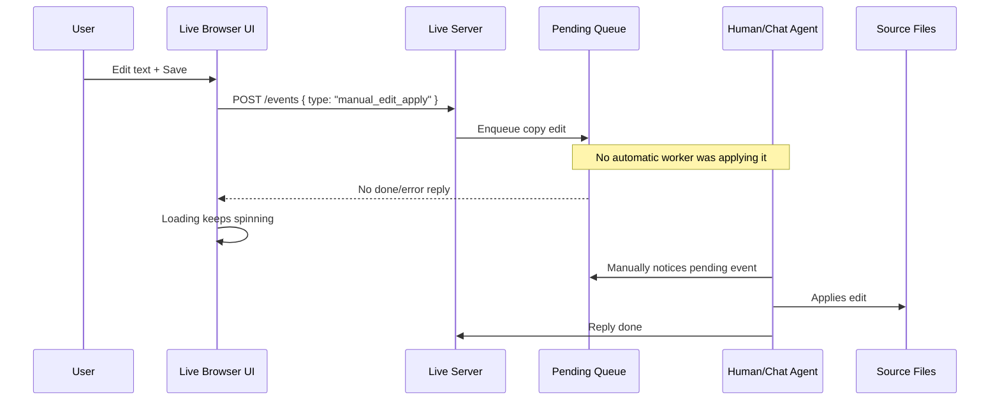
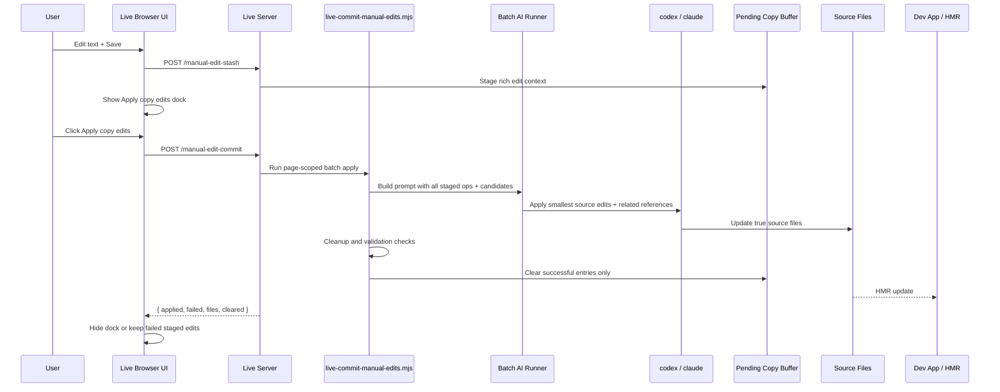

# Live AI Flow Diagrams

These diagrams explain the difference between the existing Go pathway, the stuck direct copy-edit Save pathway, and the restored staged copy-edit Apply pathway.

The Go pathway uses the existing long-poll agent loop: the browser queues work, and an agent polling through `live-poll.mjs` handles it. Copy edits now stage immediately on Save, then the Apply copy edits dock runs one batched AI source-apply operation.

## Go Pathway

## Previous Stuck Copy Pathway

## Target Staged Copy Apply Pathway

